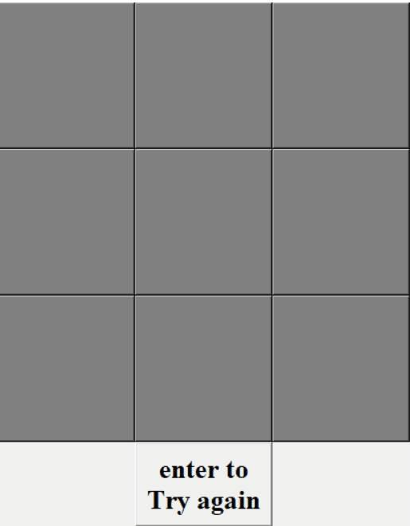

# ticTacToePython
tic tac toe on python using GUI and Console.

the file tic_tac_toe_Console is for 2 players and cp using minimax algorythm .

the file tic_tac_toe_GUI is for 2 players , the first player is X ,and the second is O .

